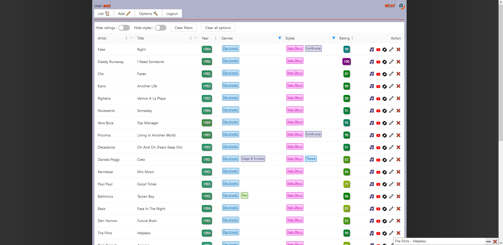
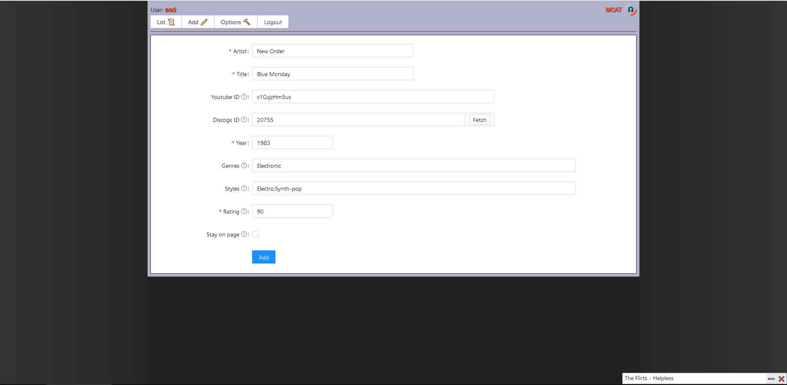

## MCAT - Music Catalogue

Welcome to MCAT - Music Catalogue by exewin, an application which main goal is to store data
about your favourite songs and display it with detailed information in a table. Additional
functionalities, MCAT provides are:

- Sort table by artist, title, year or rating
- Filter table by genre or style
- Find song by title or artist
- Quick add song by Discogs ID
- Mini video player

Project made in React

### `npm start`

Runs the app in the development mode.\
Open [http://localhost:3000](http://localhost:3000) to view it in your browser.

The page will reload when you make changes.\
You may also see any lint errors in the console.
